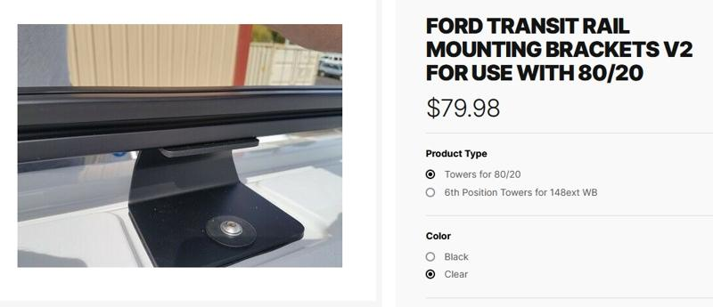
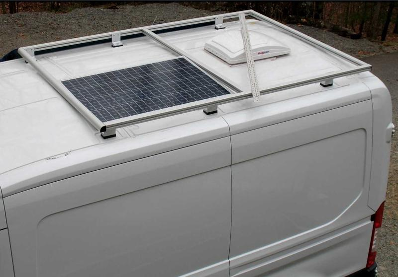
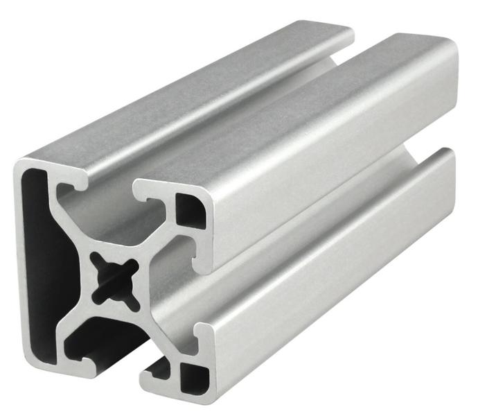

# 80/20 DIY Roof Rack

Another trend I see in the #vanlife world and overlanding community are outrageously expensive full roof racks on vehicles. I guess that makes sense for a pickup or Jeep, but the roof of my van is ten feet off the ground. I needed a simple, inexpensive solution to hold solar panels, maybe a Starlink satellite and possibly my traction boards.

I found these aluminum brackets on [DIYVan](https://diyvan.com) for mounting 80/20 extruded aluminum directly to the threaded holes that are already in the roof of the Transit.

After goolging I found exactly what I was looking for, nice and simple. It's 15 series 80/20 aluminum extrusion sitting on top of mounts that attach to the threaded roof openings.

Lots of measuring on a step ladder later, I decided on 74" lengths of 1503-LS extrusion to run down the sides of the van. It's got 3 sides to accept connectors and a smooth 4th side I plan on facing out for a nice finished look.

Stay tuned, I am waiting on hardware to show up before continuing work on the roof rack!

Next up, a look at the solar panels. :arrow_forward: [Solar Panels](solar-panels.md)