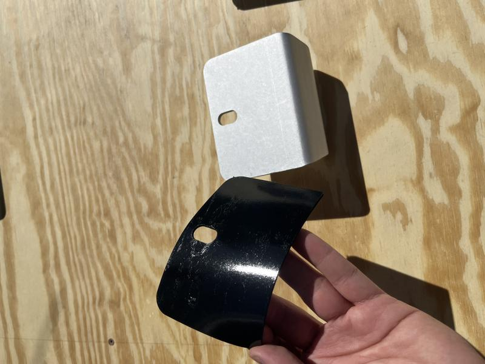
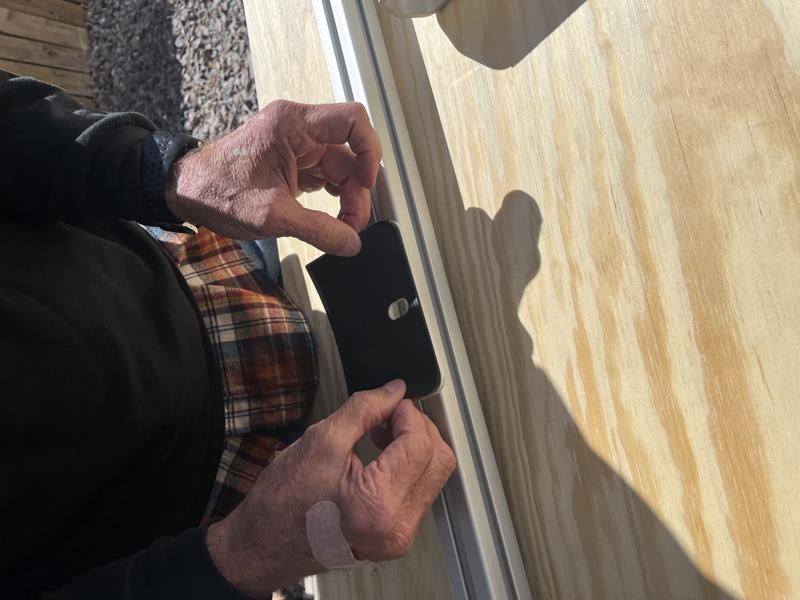
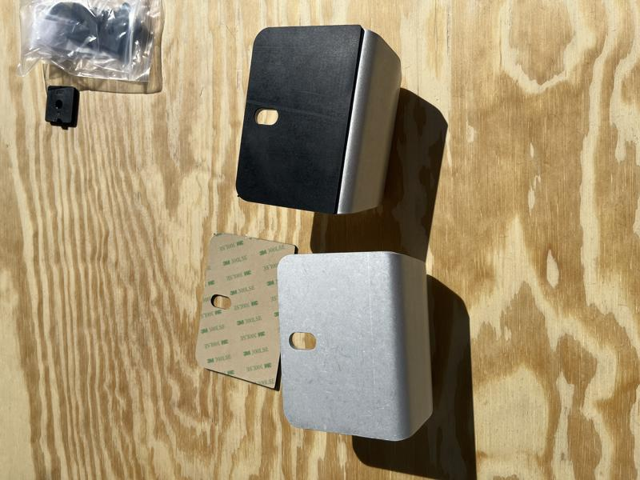
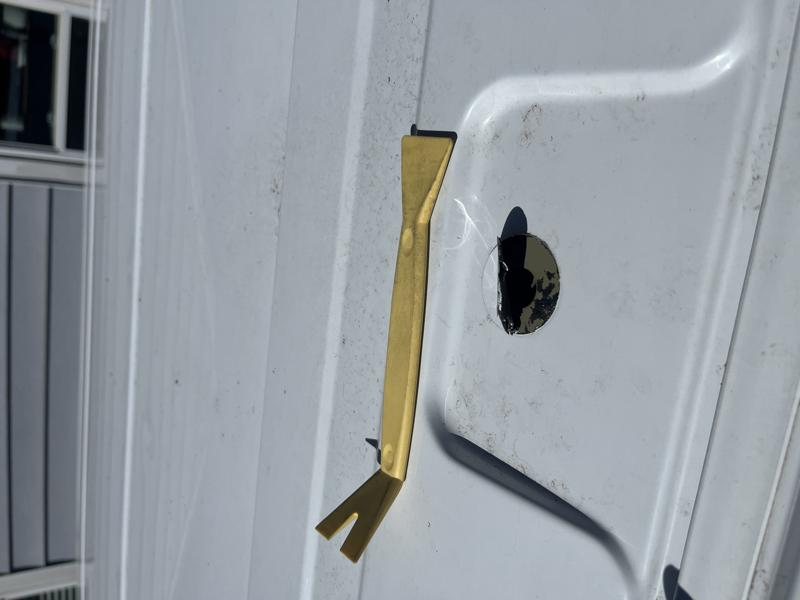
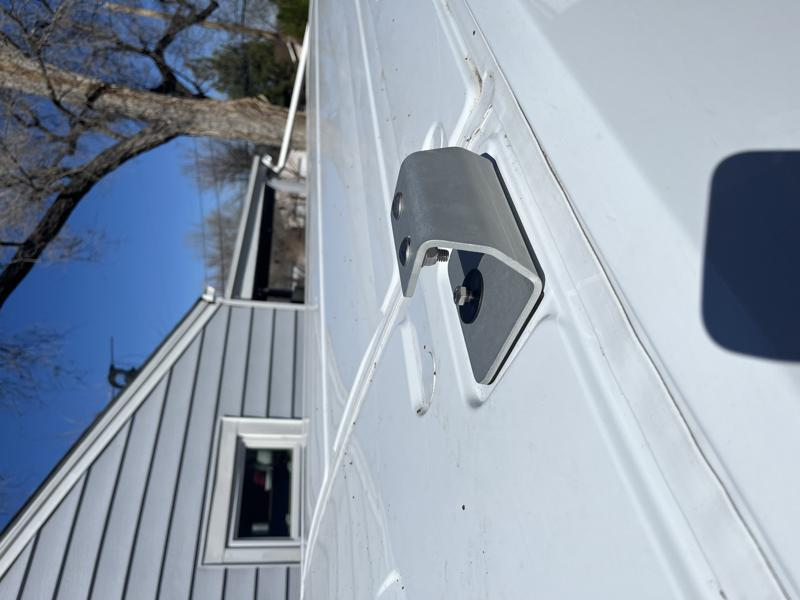
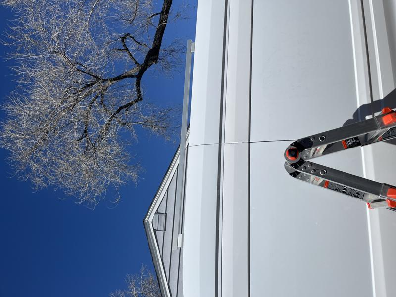
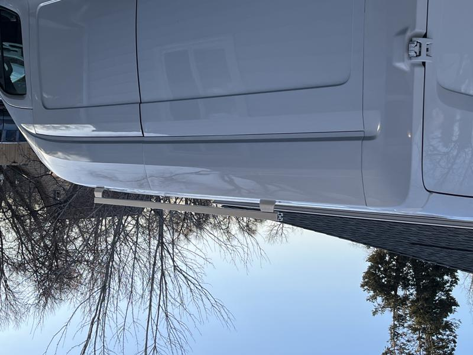

# 80/20 DIY Roof Rack

Another trend I see in the #vanlife world and overlanding community are outrageously expensive full roof racks on vehicles. I guess that makes sense for a pickup or Jeep, but the roof of my van is ten feet off the ground. I needed a simple, inexpensive solution to hold solar panels, maybe a Starlink satellite and possibly my traction boards.

I found these aluminum brackets on [DIYVan](https://diyvan.com) for mounting 80/20 extruded aluminum directly to the threaded holes that are already in the roof of the Transit.

After goolging I found exactly what I was looking for, nice and simple. It's 15 series 80/20 aluminum extrusion sitting on top of mounts that attach to the threaded roof openings.

Lots of measuring on a step ladder later, I decided on 74" lengths of 1503-LS extrusion to run down the sides of the van. It's got 3 sides to accept connectors and a smooth 4th side I plan on facing out for a nice finished look.

The brackets come with a 3M adhesive rubber patch to place on the underside of the base to keep it from scratching the roof and provide a little weather barrier.

Applying the rubber patch to the underside of the mount that is already attached to the 80/20.

Here's another shot showing the before/after.

There are pre-threaded holes on the roof of the van that are covered with a rubber patch. I used a trim tool to pry up four stickers to access the threaded insert.

Here's a dry fit of the mount tower with the screws.

The finished look, I like the low stance of the rack and it will support the weight of the solar panels easily.

Here's another look of the rack from the rear of the van.

Next up, installing solar panels. :arrow_forward: [Solar Panels](solar-panels.md)