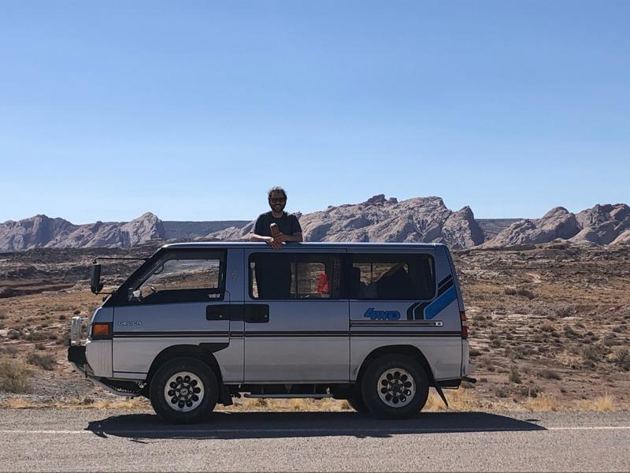
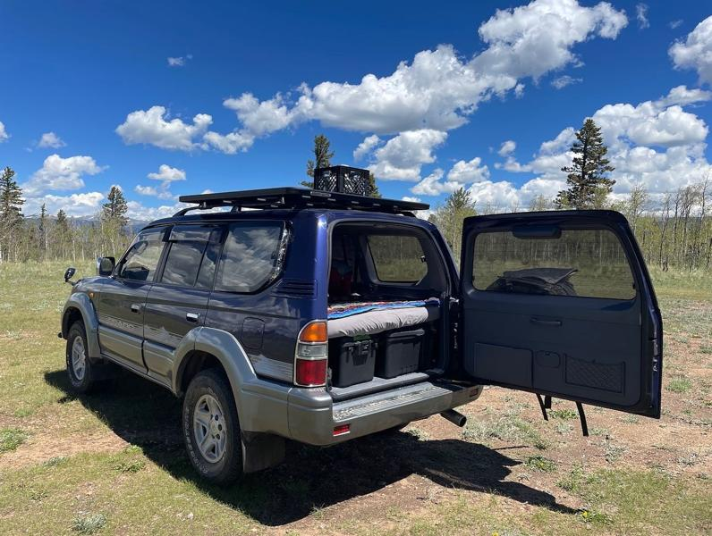

# About

I guess I am a little obsessed with camping inside the vehicles that I own. There are a lot of great places to get outside in Colorado and being able to basecamp out of your vehicle makes those places a lot more fun to visit. 

I think when I really got the bug for car camping was this trip to Moab, Utah camping out of a Mitsubishi Delica I imported from Japan.

This gradually evolved into bed setup in the back of my 1996 Toyota Landcruiser Prado with a roof rack on top.

