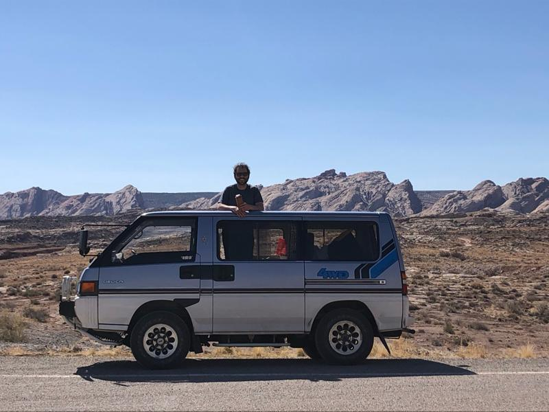
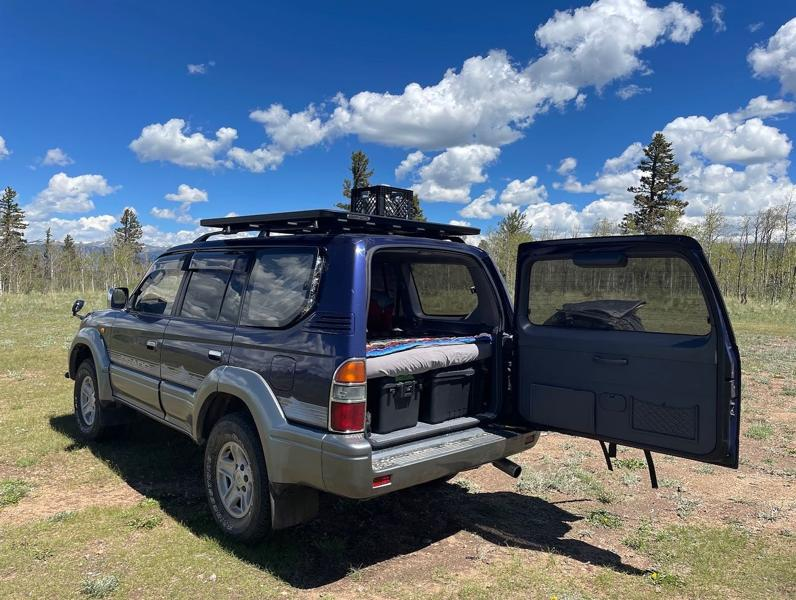

# About

Hey, I'm Casey — and yes, I am a little obsessed with camping inside my own vehicles. Colorado has no shortage of incredible places to get outside, and being able to basecamp out of your vehicle makes all of them more fun to visit.

I think when I really got the bug for car camping was this trip to Moab, Utah camping out of a Mitsubishi Delica I imported from Japan.

This gradually evolved into a bed setup in the back of my 1996 Toyota Land Cruiser Prado with a roof rack on top.

There were several other vehicles along the way and lots of amazing camping trips and now I am excited to have graduated to a high roof van that I (6'2") can stand up inside! 🙌