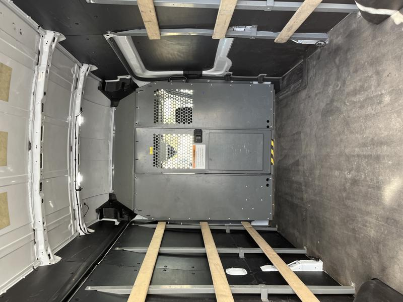
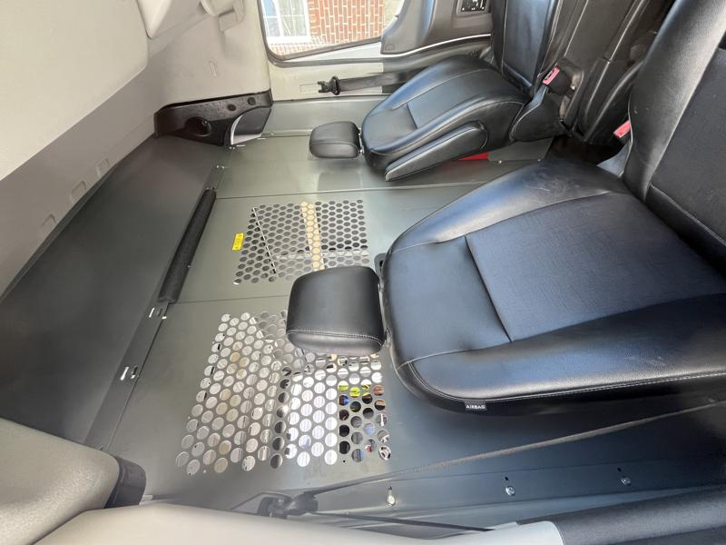
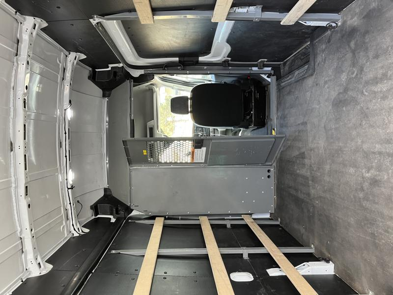
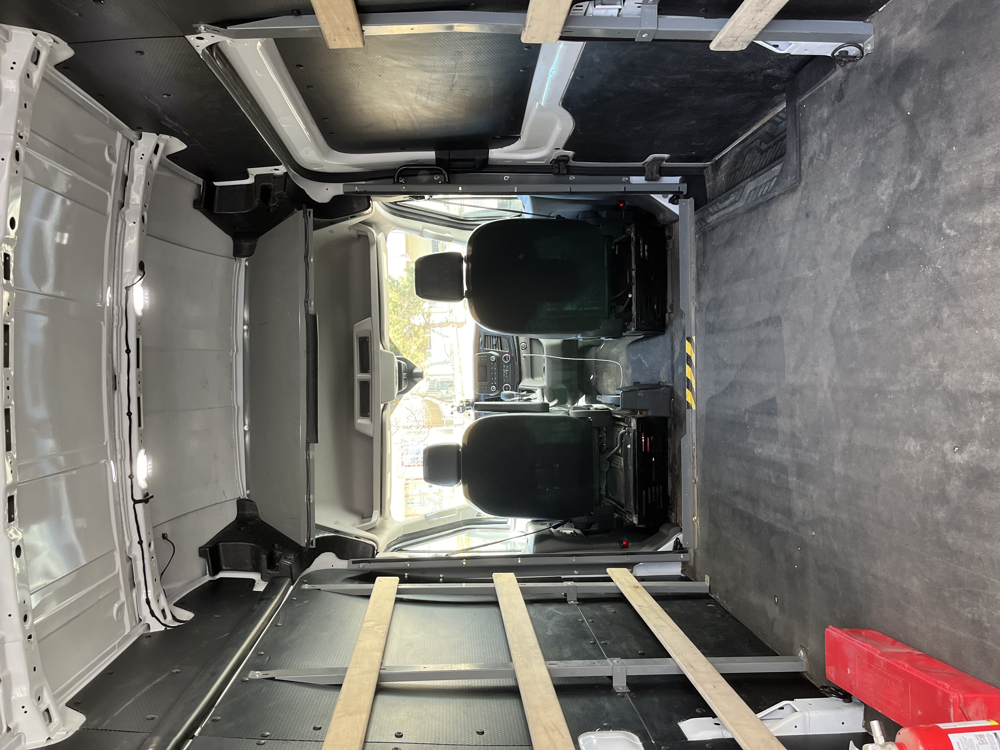
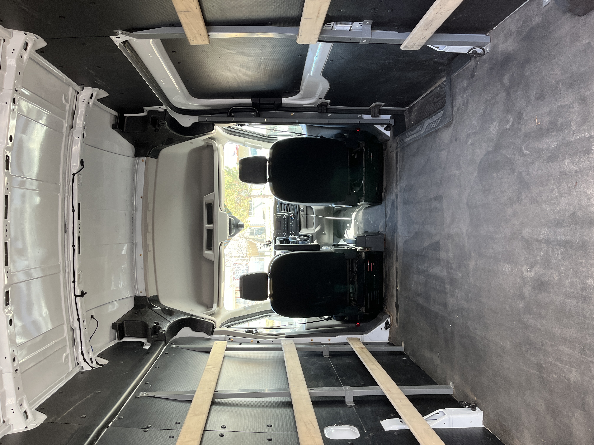

# Removing the Bulkhead

Vincent Vango was a rental van during the first chapter of his life and came installed with a very heavy steel bulkhead. First order of business was to remove the bulkhead to open up the space and make way for installing the seat swivels.

It was mainly a lot of 11mm bolts that I made quick work of with my impact drill.

Full view of the front, it was very tight against the front seats.

Removal of half the bulkhead.

Had to remove the floor piece that was screwed in with rivnuts that ended up being rusty. :cry:

Completely removed, so much more room for activities!

Next up, dealing with the rust I found on the floor. :arrow_forward: [Rusty Floor Mitigation](rusty-floor.md)