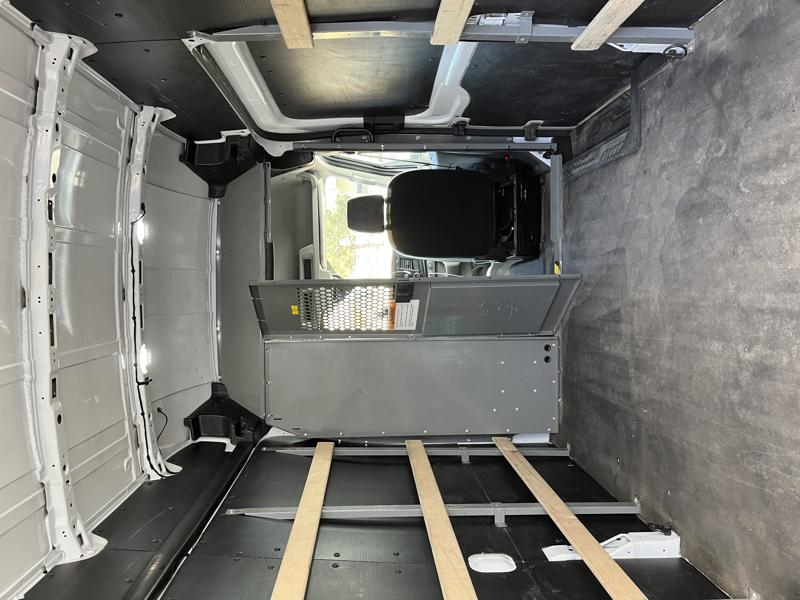

# Removing the bulk head

My van was a delivery van during its first life and came with a metal bulk head. First order of business was to remove the bulk head to open up the space and make way for installing the seat swivels

It was mainly a lot of 11mm bolts that I made quick work of with my impact

Full view of the front, very tight against the seats

Removal of half the bulk head

Had to remove the floor piece that was screwed in with riv-nuts that ended up being rusty. :cry:

Completely removed, so much more room for activites!

Next up, dealing with the rust I found on the floor. > [Rusty Floor Mitigation](rusty-floor.md)