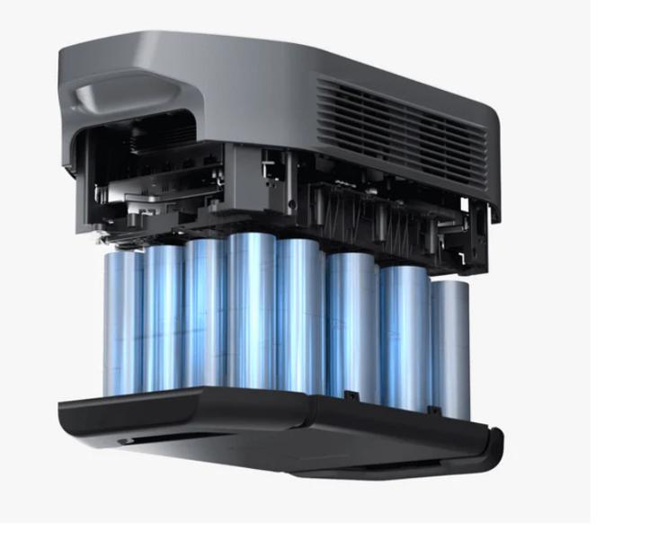
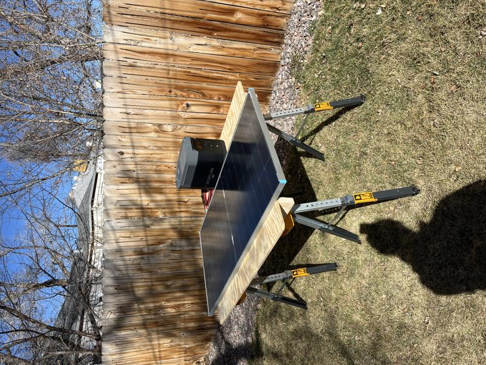
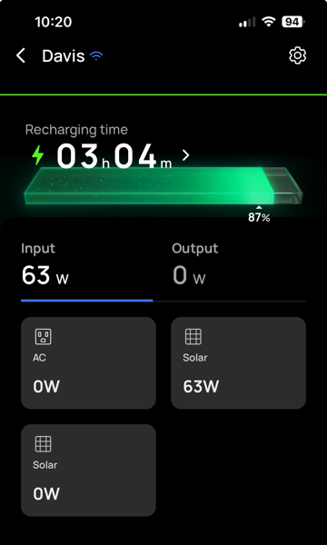

# Ecoflow Delta 2 Max

While daydreaming about this whole van build idea I originally was going to do like the majority of builders, slap some Battleborn Lithium Batteries in there with a slew of Victron equipment and have an insanely complex electrical system with all kinds of knobs and buttons. But then I realized I really only have a few simple loads to power and didn't want all that space to be sacrificed. So after a lot of research I settled on an Ecoflow Delta 2 Max Portable Power Station.

Specs:

 - 2048Wh of power!
 - Built in BMS
 - Light and compact in one piece
 - Has power output of up to 3400W.
 - Expandable up to 6kWh
 - Has dual solar inputs up to 1000W. (Perfect for my 2 220 watt solar panels)

I ended up getting this unit on sale for a pretty good price during Thanksgiving 2023. This was before I even had the van but I knew it would be really useful camping or working remotely.

But in the van it will fit comfortably under a bench or behind a storage compartment, have easy access to solar cables from the roof and should be much simplier to integrate. :fingers_crossed:

 The solar panel connected directly to the Ecoflow via XT60 connector. Quick backyard test.

 

Charging time in partial shade on the Ecoflow app. Charging time was 40 minutes total in full sunlight. I imagine having a second panel will keep it topped off most of the time.

Stay tuned, I am working on finalizing the DC panel to run the lighting, fans, etc.

Next up, interior lighting. :arrow_forward: [Lighting](lighting.md)