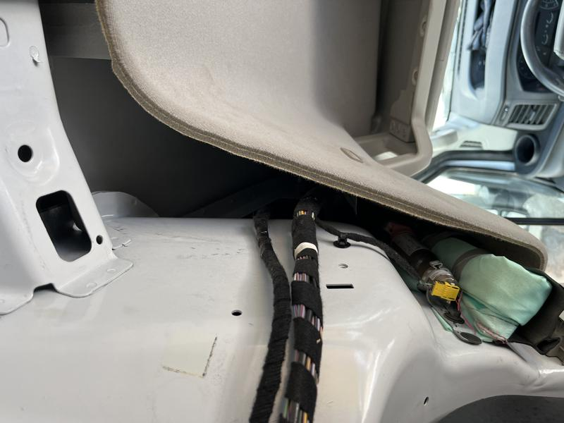
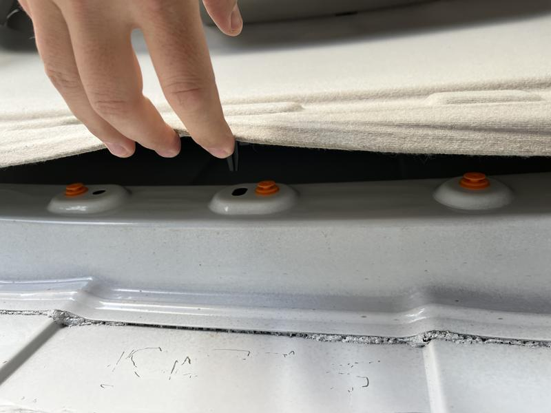
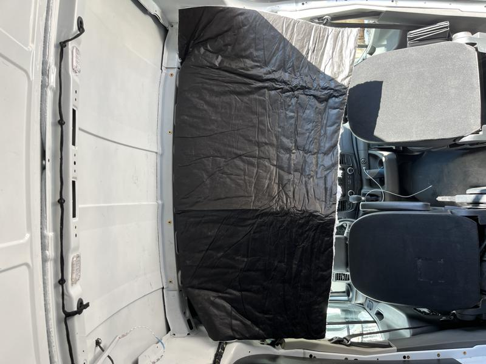

# Thinsulate Headliner

Everyone who builds out a camper vehicle seems to have their own opinion about insulation. I feel like I have read a hundred different ways to do it and ultimately I ended up choosing [3M SM600L Acoustic and Thermal insulation](https://www.3m.com/3M/en_US/p/d/b40068152/) for Vincent. This was largely based off the in-depth and excellent website guide from [Far Out Ride](https://faroutride.com/insulation/).

There is a large space above the headliner in the front of the van that is a great place to start insulating. Here are the steps to loosen the headliner.

Start by removing the two bolts in each handle above the driver and passenger seats.

There are large cavities on either side of the headliner that need to be filled with insulation. The green tube by the window is the airbag!

Remove the three clips in the center of the headliner so it can be lowered. A trim removal tool works great here.

There are large cavities on either side of the headliner that need to be filled. Passenger side airbag in this photo.

I measured and cut the thinsulation and started sliding it down into the edge of the windshield. Be sure to wear gloves, lots of jagged metal on the roof. :drop_of_blood:

Once the insulation was tucked in I straightened it out and pressed the plastic clips back into place securing the headliner back to the roof.

Next up, insulating the sliding rear door. :arrow_forward: [Sliding Door Insulation](slider-insulation.md)