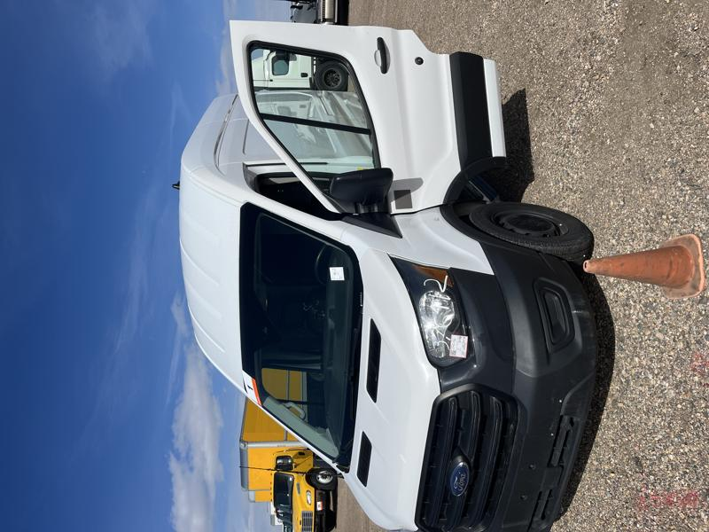

# Meet Vincent Vango

This is my 2020 Ford Transit I purchased used at auction in northern Colorado. It was a Penske truck in its previous life. The van was a little scraped and dinged up but otherwise in fine shape considering its age. It was fleet maintained so there was always regularly scheduled oil changes and a new pair of front brake pads before I became the owner.

-   ## Specs

    ---

    :material-van-utility: __2020 Ford Transit T-250__

    ---
    
    :material-tape-measure: __148 Wheel Base High Roof__

    ---
    
    :material-engine-outline: __3.5L PFDI V6 engine producing 275HP__

    ---

    :octicons-milestone-16: __Mileage: 100,896 as of April 1st, 2024__

    ---

    :wheel: __Transmission: Rear Wheel Drive__

    

These are my notes as I baseline and build out the van for weekend adventuring, remote office and using as a utility vehicle.

## New Pages 

As of 6/10/2024

:new: [Lighting](lighting.md)

:new: [Swaybar](swaybar.md)

:new: [Inside Ceiling](ceiling.md)

Navigate using the menus on the left or :arrow_forward: [First Steps: Bulkhead Removal](bulkhead-removal.md)