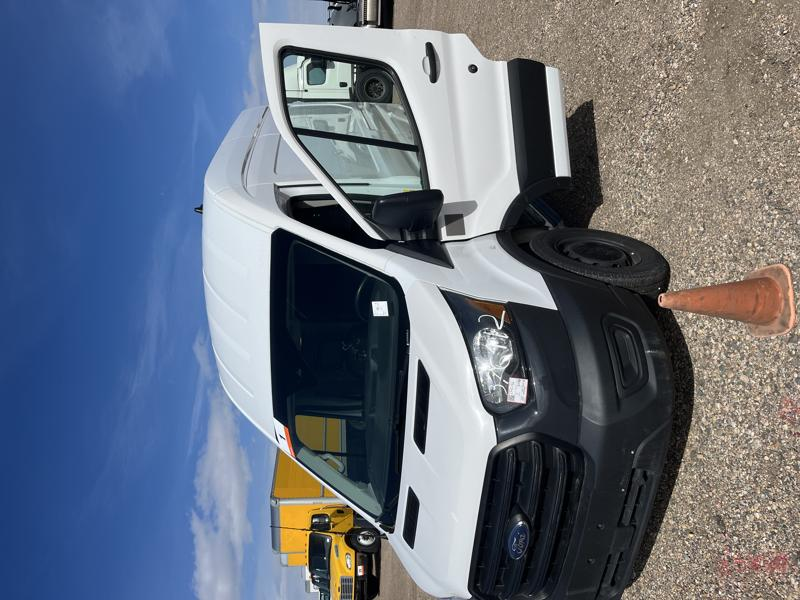

# Meet Vincent Vango: A Ford Transit Van Conversion Build

This is my 2020 Ford Transit 250 — a former Penske rental truck I picked up at auction in northern Colorado. A little scraped and dinged, but fleet-maintained with regular oil changes and fresh front brake pads. Good bones for a van build.

-   ## Specs

    ---

    :material-van-utility: __2020 Ford Transit T-250__

    ---
    
    :material-tape-measure: __148 Wheel Base High Roof__

    ---
    
    :material-engine-outline: __3.5L PFDI V6 engine producing 275HP__

    ---

    :octicons-milestone-16: __Mileage: 100,896 as of April 1st, 2024__

    ---

    :wheel: __Transmission: Rear Wheel Drive__

    

These are my notes documenting the Ford Transit van conversion — from rust mitigation and insulation to solar power, a platform bed, and all the van life upgrades in between. Whether you're planning your own camper van build or just here for the ride, welcome.

## New Pages 

As of 6/10/2024

:new: [Lighting](lighting.md)

:new: [Swaybar](swaybar.md)

:new: [Inside Ceiling](ceiling.md)

Navigate using the menus on the left or :arrow_forward: [First Steps: Bulkhead Removal](bulkhead-removal.md)