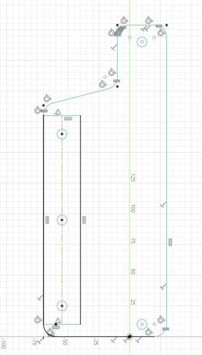
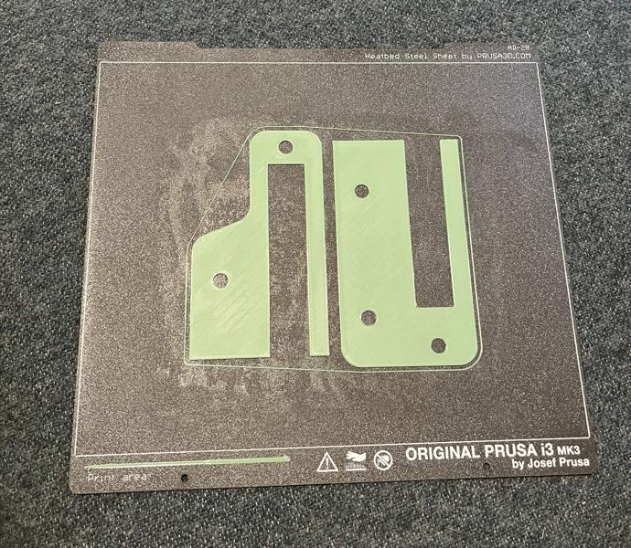
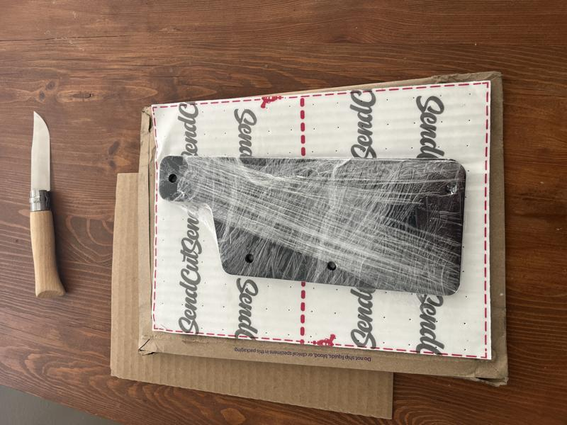
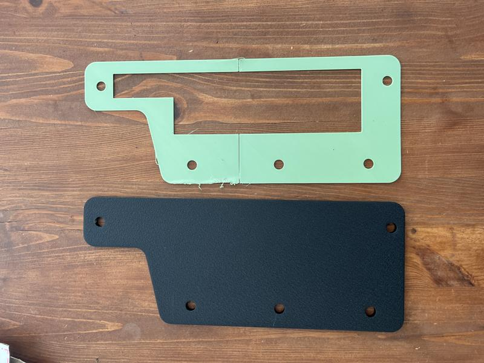
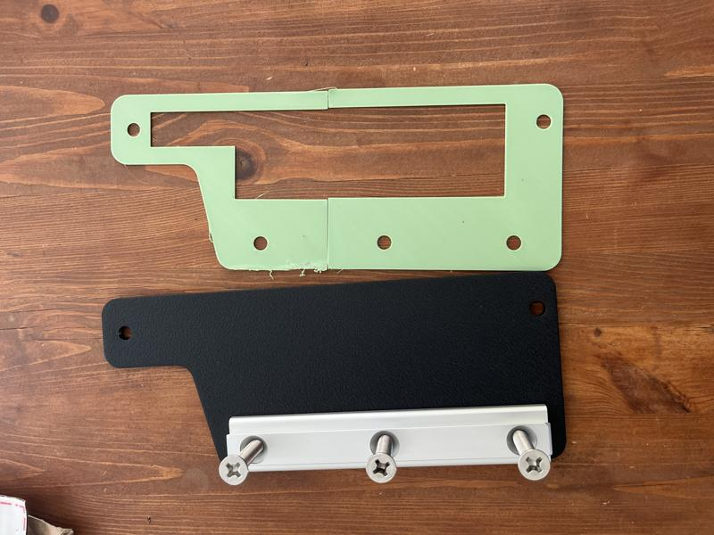
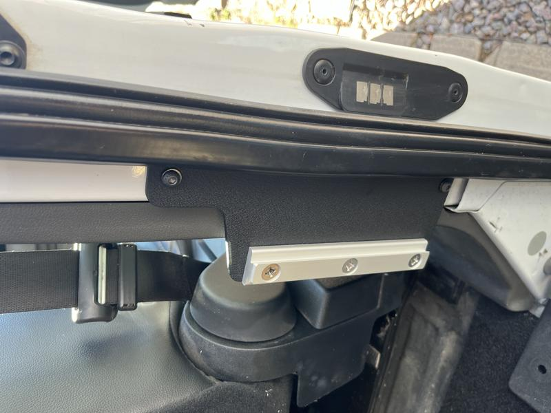
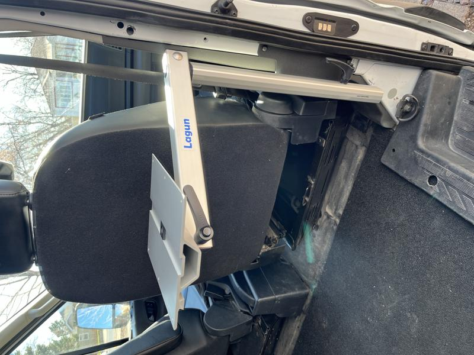
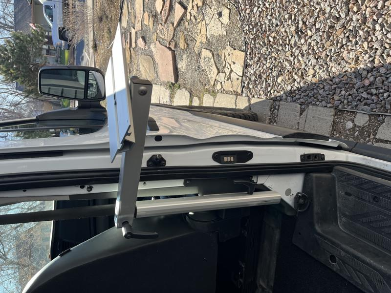

# Lagun Table plus Custom Mount

Lagun tables are pretty popular in conventional RV's and I wanted to put one in the van to use as my desk and also a handy charcuterie board or beer holder while camping.

There are pre-threaded holes by the sliding door on the van and I thought that would be a good place to mount the table. I was going to have to fabricate a custom mount to fit the door of the van but also to hold the Lagun slim mount. I fired up CAD and came up with a drawing. I printed the drawing out on my 3D printer as a template to make sure it was going to fit correctly.

Here's my CAD drawing that I started out with after taking measurements from the van.

I just did a real thin print to hold up to the van and make sure it was going to fit correctly. I cut the hole out of the middle of the 3D print just to speed up printing. It was too large to print in one piece on my printer so I had to split it into two prints.

Once I verified my part would fit using the thin 3D print, I submitted an order to have it waterjet cut from 5052 H32 Aluminum that was (.187") thick AND added black powdercoating.

Here is the finished aluminum part powdercoated black on the left and my green 3D printed template I used before submitting the order.

This is a photo of the Lagun slim mount attached to the custom mount.

Here is a closeup of the sliding door behind the passenger seat. You can see how the mount is attached to the van using button head allen screws. Next up is attaching the lagun mount arm.

This is the Lagun mount arm attached to the mount on the side of the van. Ultimately this will be more useful when I install the Scopema seat swivels in the future. After a small table top is added it will be a desk for my laptop.

Finally you can swivel the table out the sliding door and it makes a handy table for when you are camping!

The beauty of the Lagun tables are the cam lock levers that make it quick and easy to put the table up and take it down when you are driving.