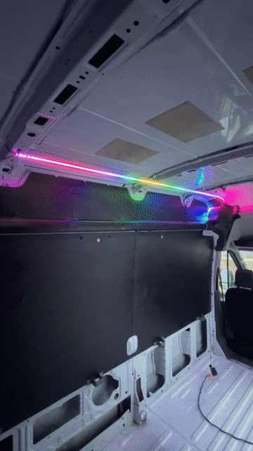
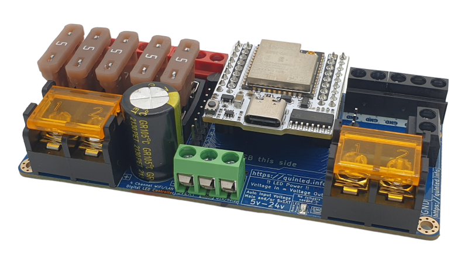
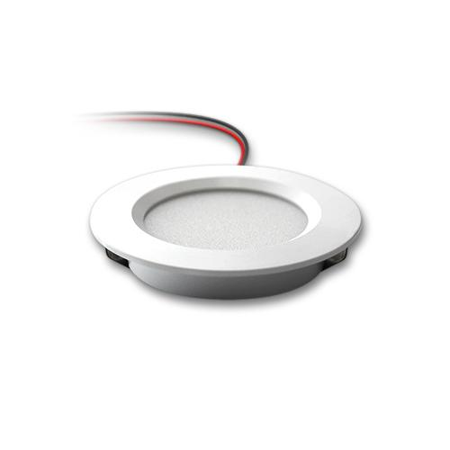
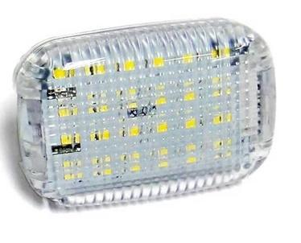

# Lighting

## Party Lights

I probably spent way too much time thinking through this portion of the install but with led's and RGB lighting there are so many fun options that don't cost a lot of money. Here's a quick demo of what I am want to install on the ceiling:

Party lights are going to be ran via a [QuinLED Dig-Quad](https://quinled.info/pre-assembled-quinled-dig-quad/) board running the latest version of WLED.

This board can power four strands of addressable LED lights. I was thinking about running two strands on the ceiling, one strand on the floor for accent lighting and maybe having a connector to run a strand outside the door around an awning during camping.

## Regular Lights

Right now I am between using the 12 volt puck LED lights I used in my Delica build out or possibly purchasing the square LED lights that are already in the van and use the existing mounting holes

Stay tuned, more to come on lighting upgrades