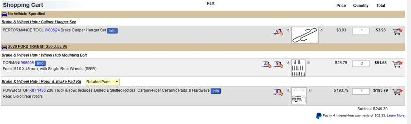

# Maintenance and Baseline

Here are some of the things I did to base line the vehicle, just basic maintenance stuff.

## Rear Brakes

For my 2020 Transit T250 here are the part numbers for Rock Auto to do a full rear brake refresh

- PERFORMANCE TOOL W80624 Brake Caliper Hanger Set
- DORMAN 966005 Wheel Hub Mounting Bolt
- POWER STOP K871436 Z36 Truck & Tow; Includes Rotors, Carbon-Fiber Ceramic Pads & Hardware

**Don't reuse your wheel hub mounting bolts! They are single use and should be replaced.**

Next up, starting to insulate the van. :arrow_forward: [Headliner Insulation](headliner-insulation.md)