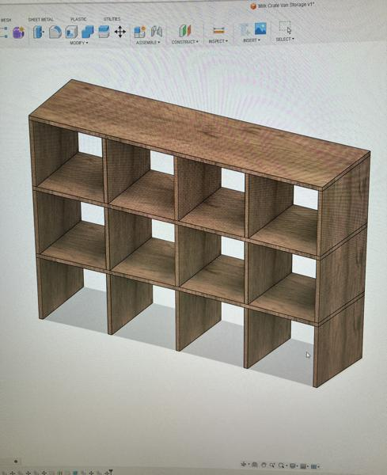

# Milk Crate Storage

I have standardized nearly all of my tools and screws and stuff into milk crates since they are a pretty good size, they are cheap to aquire and won't be obsolete in a few years like the rolling toolbox systems they sell at the big box stores.

This is a quick rendering that I whipped up in Fusion 360 to give me an idea on how much plywood I needed to purchase for the shelving.

My friend Jeff graciously lets me use his professional wood shop for some of these bigger projects, thanks Jeff! Here I am laying out the crates to make sure the wood spacing is correct.

Here is the finished shelving that is dry fitted and sanded ready for glue.

This is a test fitting in the driver's side of the van checking the fit. I ended up cutting down the side legs a bit to get the shelf to fit closer to the wheel well.

Pretty much finished! Here you can see how the fit, I have it temporarily ratchet strapped to the side of the van.

You can see the long 3" board running the length of the van which is where I will install the bed platform.

Another shot from the front of the van showing more crates installed. Once hard right turn later they all spilled out on the floor of the van so I set off to design a "bump stop" to keep the crates in place while driving.

Here is what I whipped up in Fusion 360 to set off the front of the lip of the shelf and is long enough to "lock" in the crate while moving. Taking out the crate is easy just lifting the crate over the bump stop and sliding it over the top.

Installed on the corners of the shelf.

Added bonus - the milk crates hang out perfect without needed any kind of hinges or anything.

The crate drops into place and is nice and snug while driving.

Next up, building a platform bed. :arrow_forward: [Platform Bed](platform-bed.md)