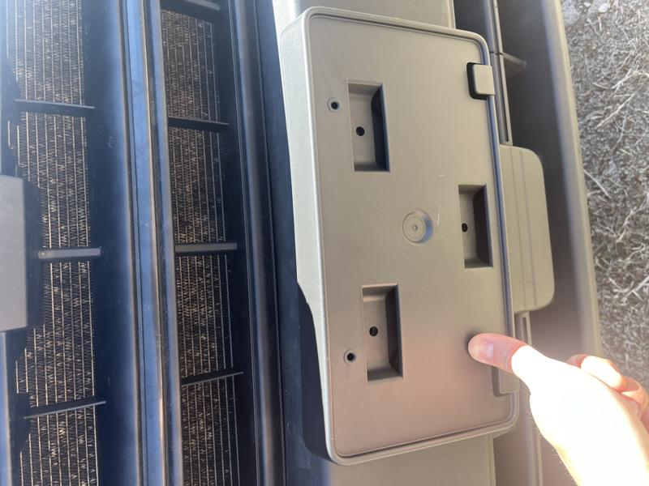
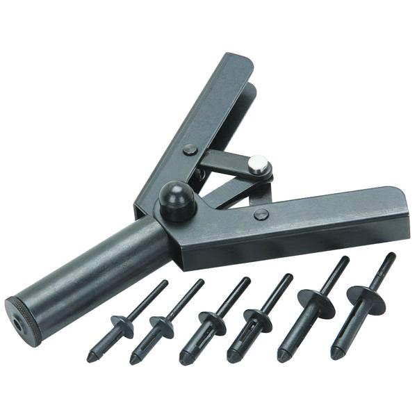
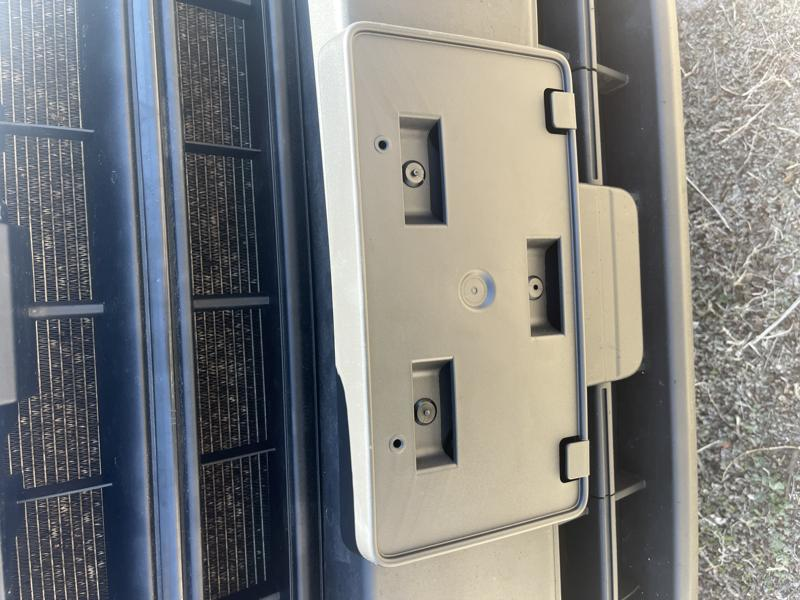

# Missing Van Pieces

## Front License Plate

The van was in pretty good shape when I received it but there were a handful of missing pieces. The first and important piece to me being in Colorado is a front license plate holder. I purchased the kit online and here is the Ford part number: **LK4Z-17A385-AA** and it was $31.

Here I am dry fitting it to the van, I needed to drill three holes to mount it.

I ended up using the PITTSBURGH 7 in. Poly Hand Riveter Kit from Harbor Freight for easy installation

Looked really nice when the pom rivets where installed in place, license plate firmly in place now!

## Driver's Door Seal

Next up, starting to insulate the van. :arrow_forward: [Headliner Insulation](headliner-insulation.md)