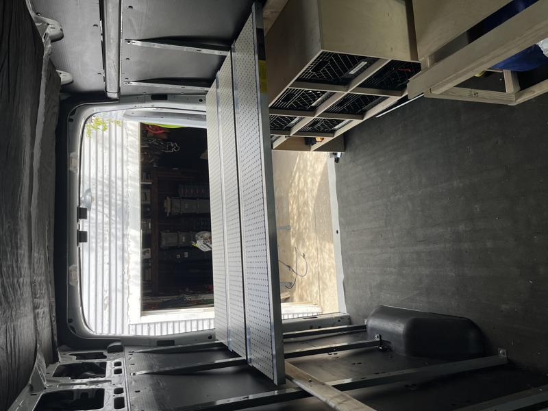

# Platform Bed

Here is the ATV loading ramp I used from Harbor Freight [HAUL-MASTER 1500 lb. Capacity 45 in. x 69 in. Tri-Fold Aluminum Loading Ramp](https://www.harborfreight.com/super-wide-tri-fold-loading-ramp-90018.html?_br_psugg_q=loading+ramps). I ended up having to purchase two of these two get the queen sized bed span I am looking for in the van.

I drilled out many, many aluminum rivets to get the ramps separated away from each other.

Next I drilled out the two rivets on each end of the ladder rung so I could adjust it later to snug it up against the sides of the van.

Here is a shot of me drilling out a hole on the metal stud that runs along the sides of the van and installed a M6 rivnut to secure the board that will hold the platform.

A finished rivnut right above the milk crate storage on the driver's side of the van.

This is the dry fit with the ramps spanning across the van and using leftover pegboard as a filler to create a flat surface.

I had a discovery that I could easily store these ramps when I don't want the ramps stretched all the way out by simply stacking them and putting a ratchet strap around them to keep from rattling while driving.

Finally a picture from the rear doors of the van showing the height at about 40" from the floor. I was at the mercy of my milk crate storage so the platform is a little higher than you would find on other builds online.

