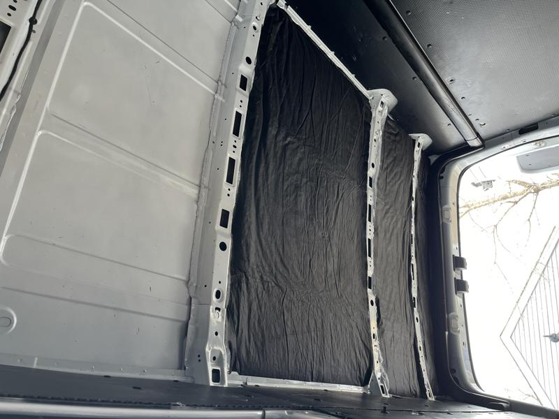

# Insulate the Roof

Pretty straightforward, I measured between the support beams and cut the insulation and spray glued it with the help of my Dad.

Next up, constructing an inexpensive roof rack :arrow_forward: [80/20 Roof Rack](8020-roof-rack.md)