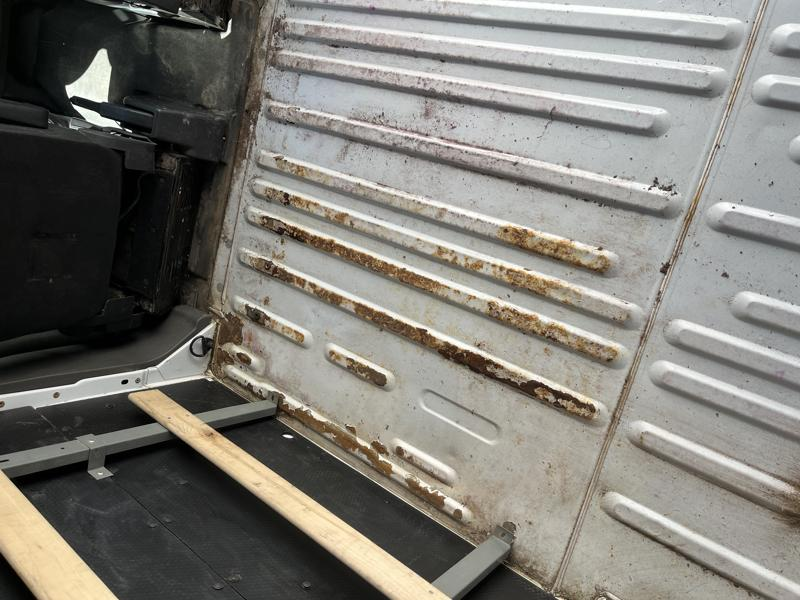
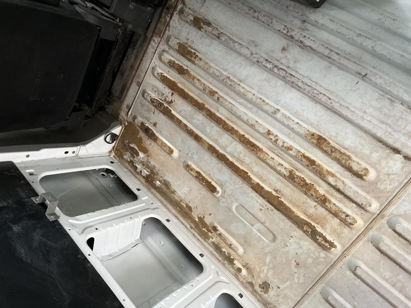
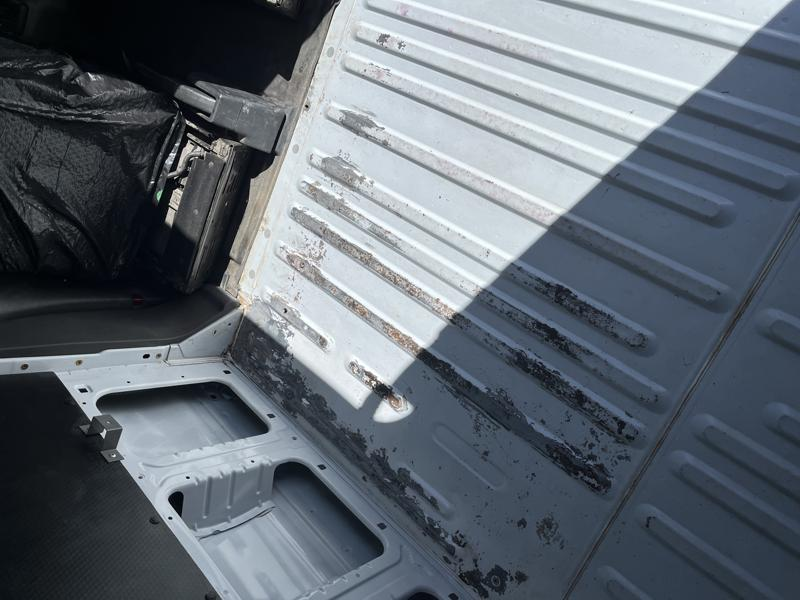
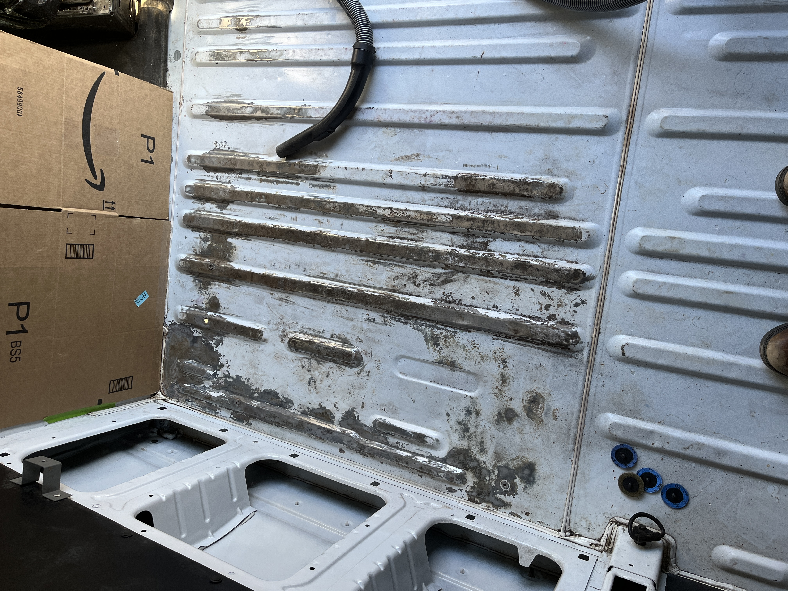
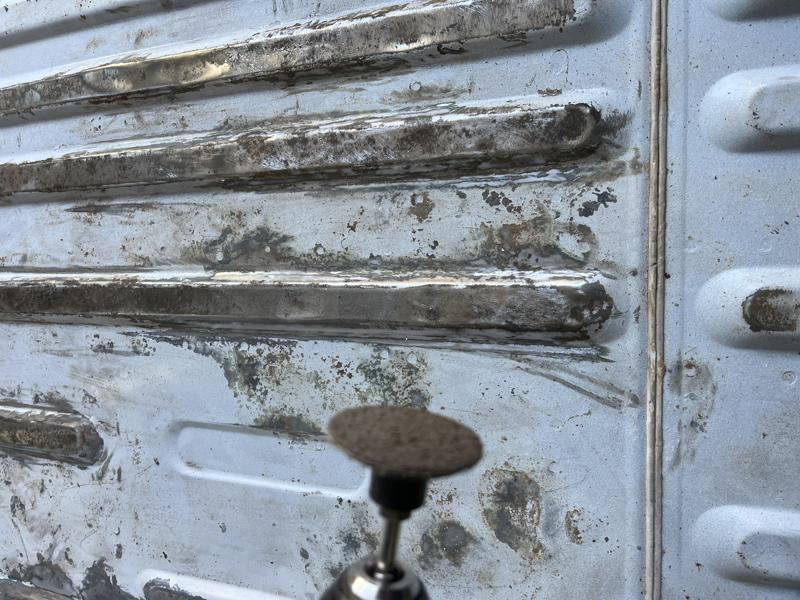
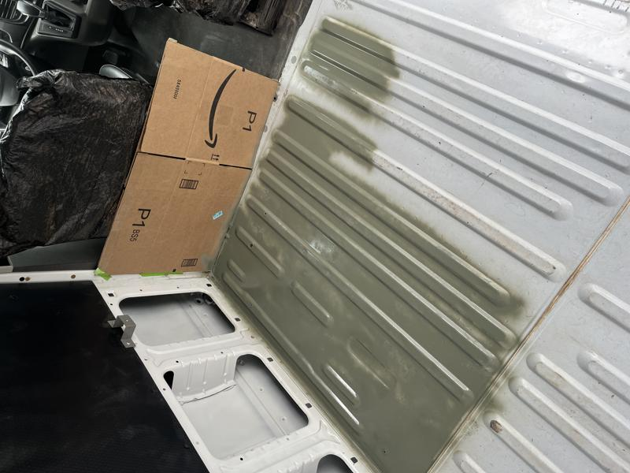
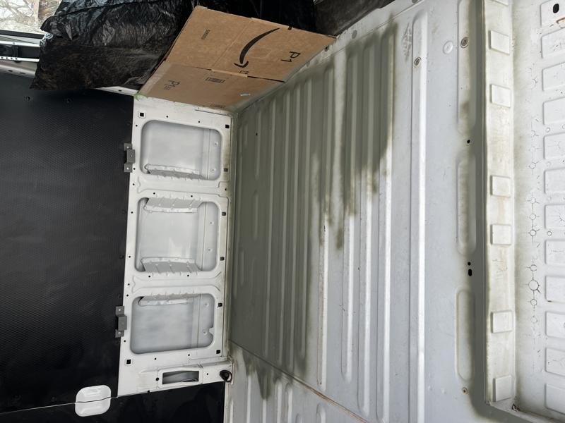
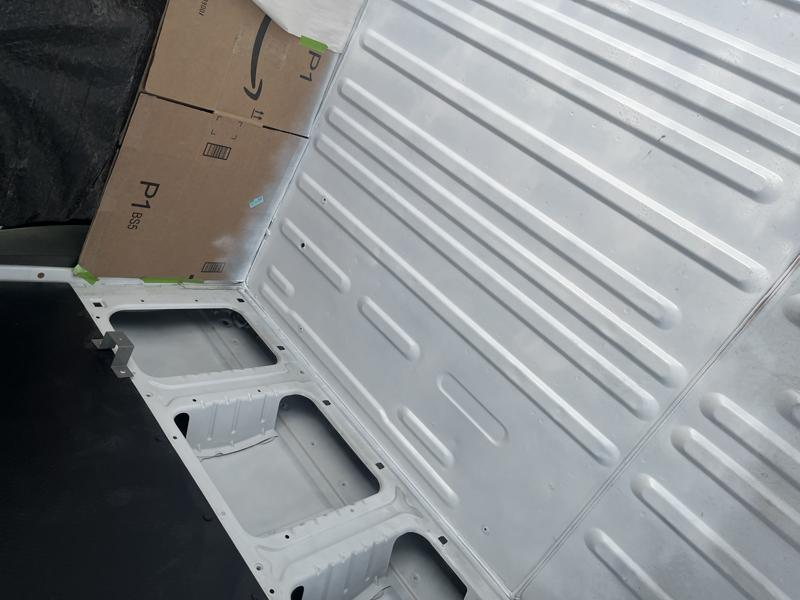

# Rusty floor mitigation

Whoever installed the bulk head did absolutely nothing to waterproof or seal the holes so moisture crept through the fasteners and soaked through the protective mat in the back of the Transit. Here is the process of mitigating the rust before laying down flooring.

This was after a light pass of sanding and scraping, fortunately it's just surface rust

I ended up using evaporust on the floor and that helped convert a lot of the rust

At the auto parts store I discovered heavy sanding discs for paint removal and that really sped up the process of getting to bare metal

Here's a shot of the medium sanding disc attached to the end of my drill

I laid down several thin layers of Rustoleum self-etching primer after cleaning the surface

Here it is after four coats of primer, starting to look better

Finally I laid down several coats of Rustoleum Automotive enamel paint

