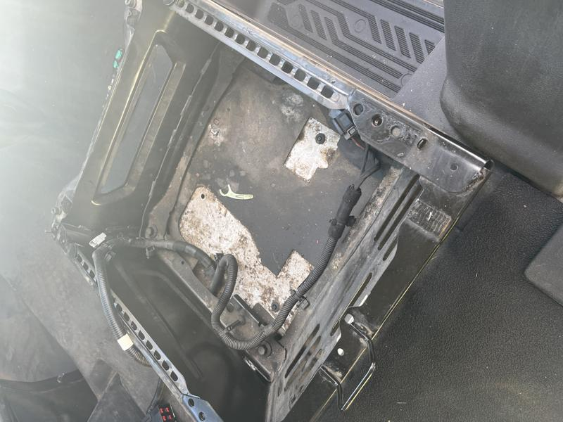
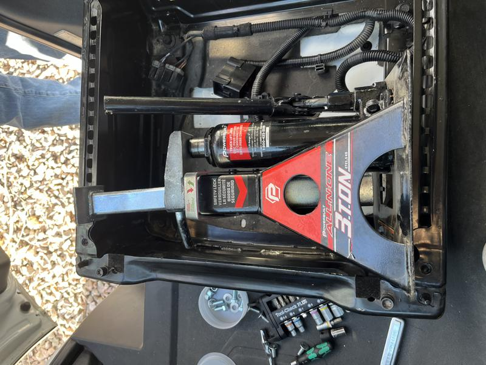
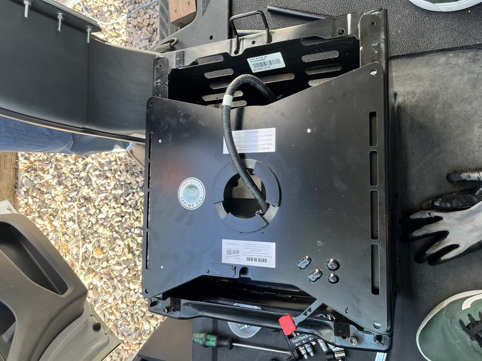

# Seat Swivel

I wanted to install a passenger seat swivel in order to utilize my Lagun table mount. I chose the Scopema passenger seat swivel for the Ford Transit and it is a really smooth, nice product.

After removing the passenger seat I had to clear out the grunge of spilled soda, trash and just general nasty stuff.

The holes did not line up very well from the Scopema mount to the seat mounts. I ended up using a car jack in order to stretch out the Ford seat mount in order to get the holes to line up. It took a few attempts but ultimately successful!

Here is a shot of the seat swivel installed on top of the Ford seat mount.

Next up, building milk crate storage for the back of the van. :arrow_forward: [Milk Crate Storage](milk-crate-storage.md)