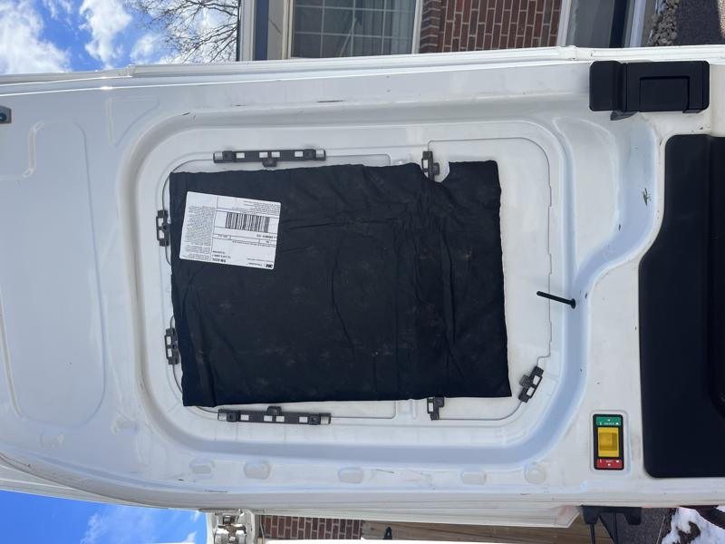
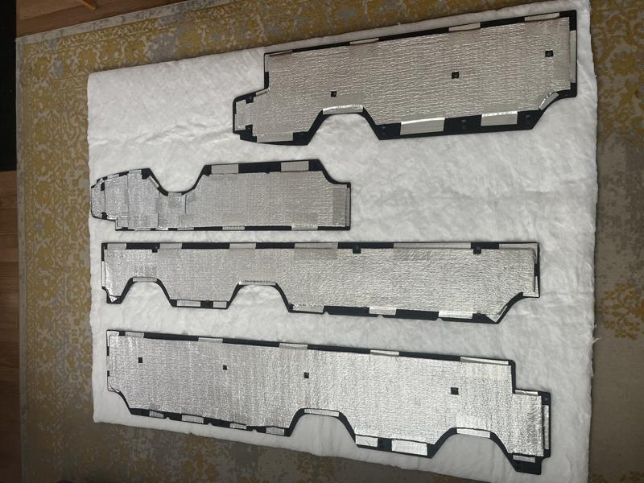
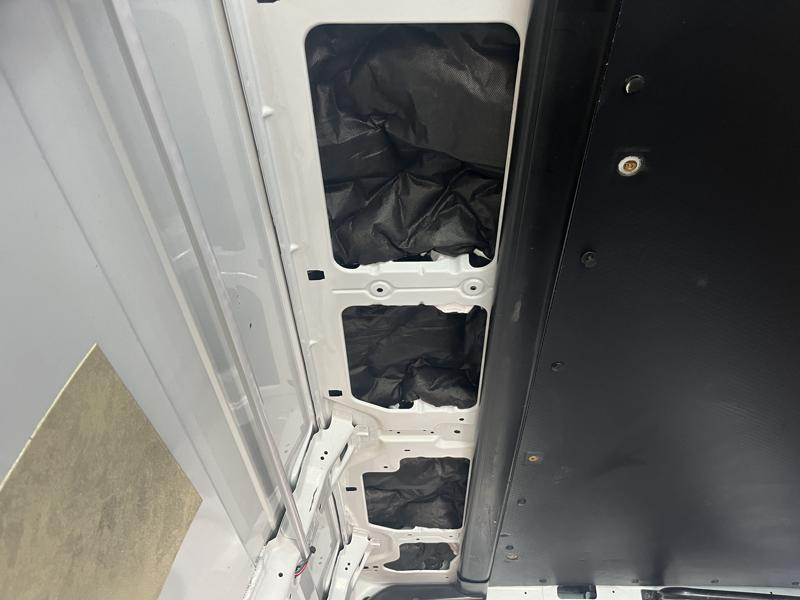

# Insulate side walls and back doors

I found heavy duty kitchen shears to be the best tool to use for cutting the 3M SM600L Acoustic and Thermal Insulation. And 3M Super 77 spray adhesive on the van door allowing 30 seconds to get tacky I could just stick the insulation directly to the door.

Here is an exposed door panel that has a piece of the insulation held by the spray adhesive. I will cover it up with the plastic corregated panel after.

Using the plastic corregated panels that came with the van made measuring the insulation easy to do on my living room floor. You can see here where I taped Low-E Reflective Insulation on the backs of each of the panels for increased insulation.

Here's a fully stuffed side wall of the van ready to be hidden behind a plastic corregated panel. I re-used the factory clips and carefully snapped them back into their holes.

Next up, insulating the roof :arrow_forward: [Roof Insulation](roof-insulation.md)