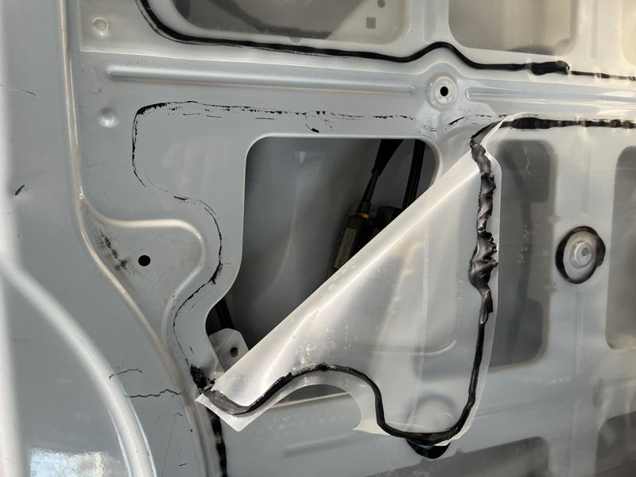
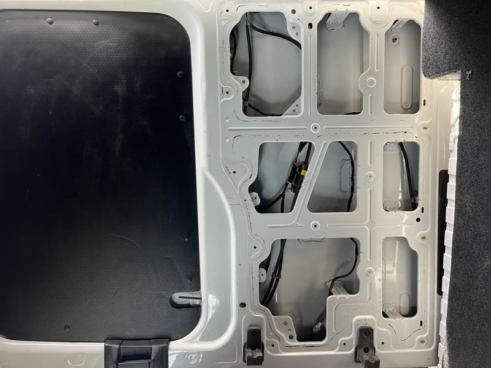
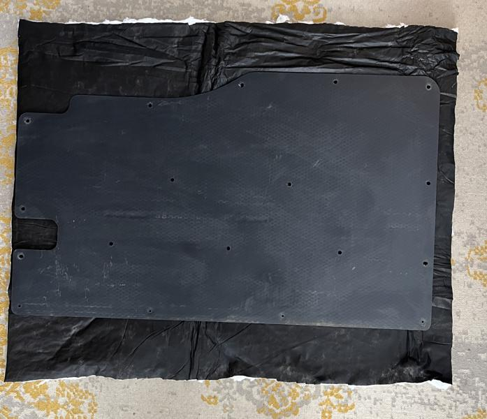
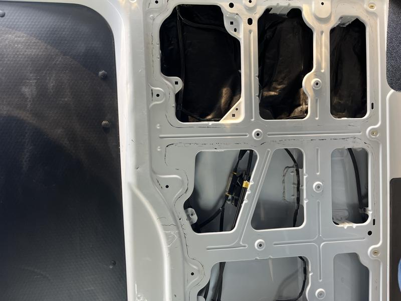
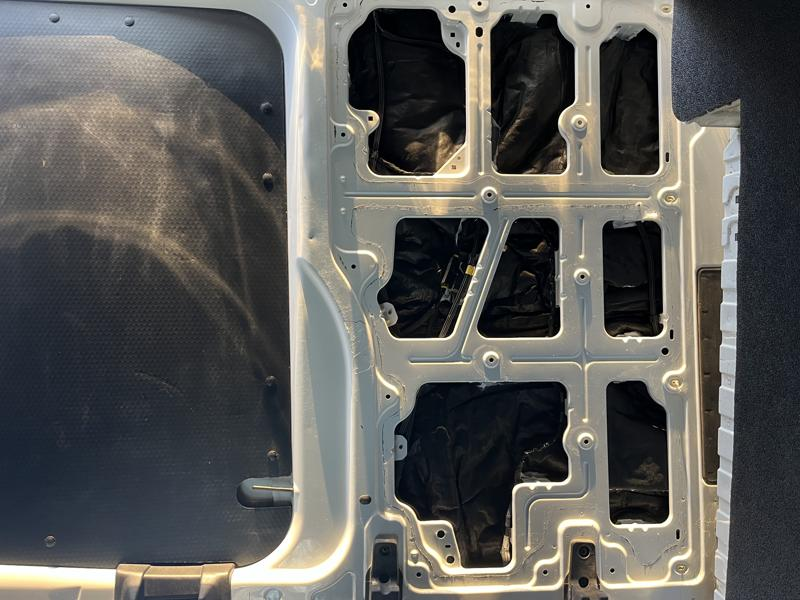
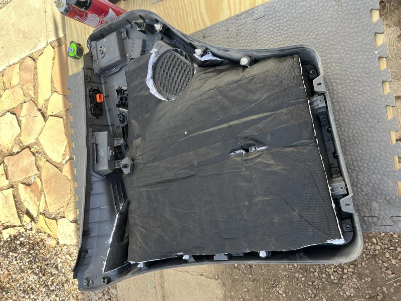

# Insulate the Doors

After carefully prying off the plastic clips to the sliding door card, there is a plastic sheeting installed by the factory that is needed to be removed. If you slowly pull on the edges you can remove the rubber gasket material and it will peel back along with the plastic sheet. A heatgun is really helpful for this.

This is what the sliding door looks like after I started peeling the plastic sheeting.

I had to do some quick measuring for cutting around the metal studs that reenforce the door. I plan on routing the insulation behind the cabling in case I need to work on that later.

I used the corrugated plastic sheeting that came from the facotry as a template to cut the thinsulate insulation. A heavy duty pair of kitchen scissors is great for this thick material.

I tucked the thinsulate behind the cabling in the door in small sections to make it easier to install. The cabling was so tight against the insulation I didn't feel the need to use spray adhesive to attach the insulation.

Here's what the finished door looks like after all the sections were installed. It helped to tug around the edges to get it smooth and pretty before covering it all up.

Finally I had some leftover insulation so I packed the front doors after upgrading the speakers.

Next up, installing insulation in the back doors and sidewalls. :arrow_forward: [Sidewall Insulation](sidewall-insulation.md)