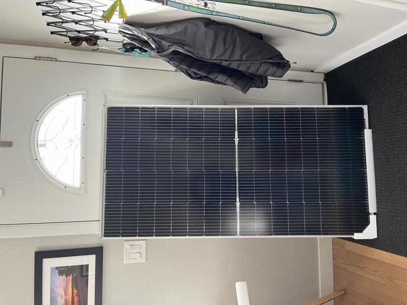
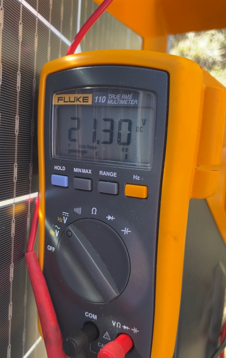
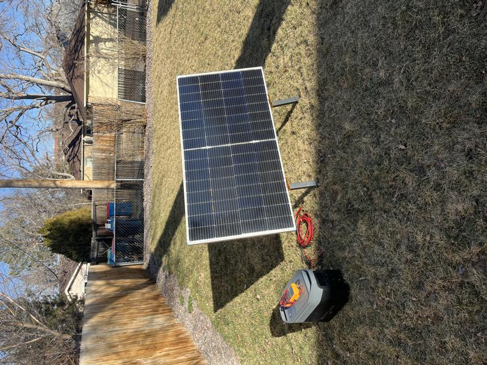
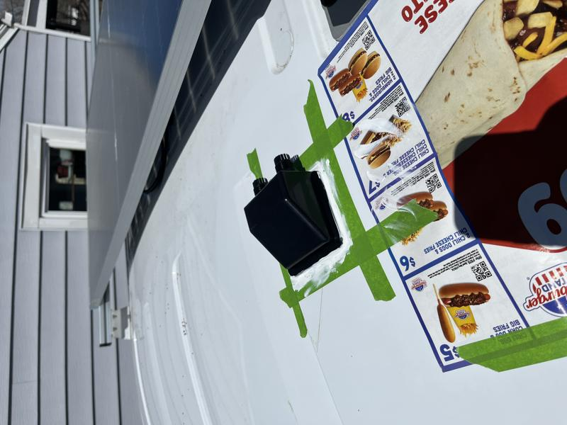
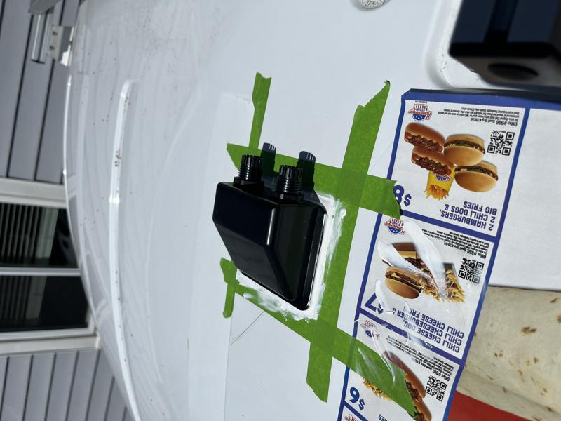
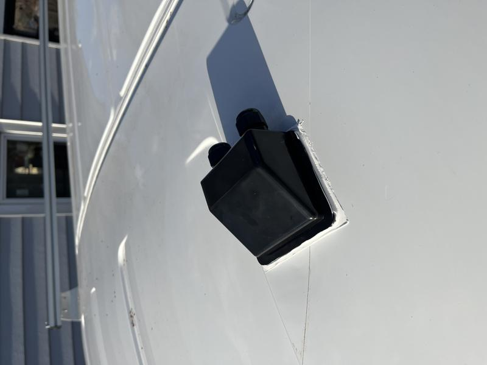
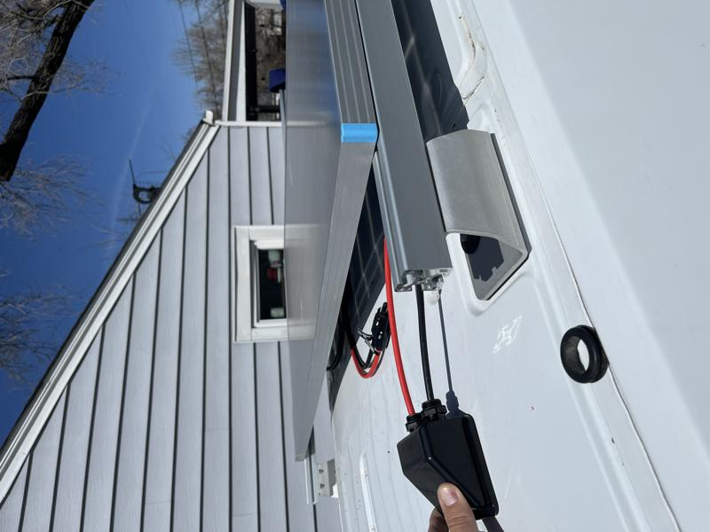
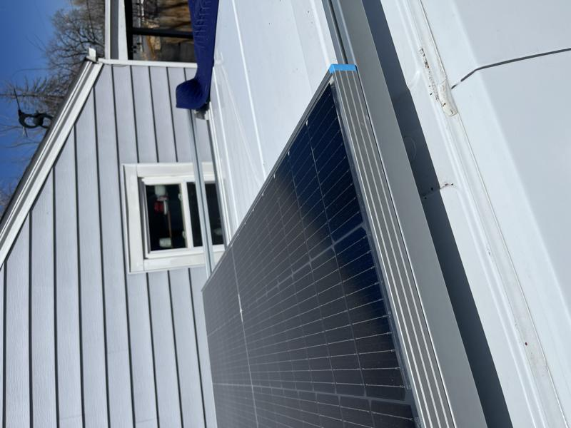
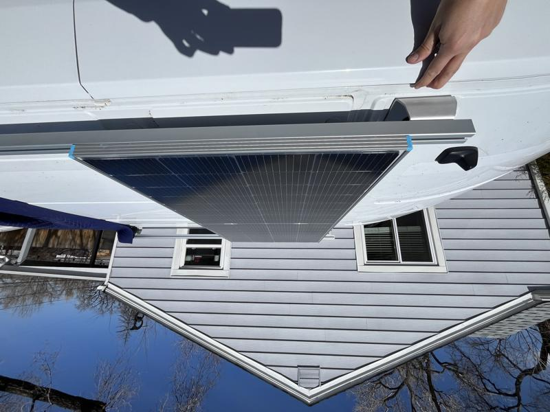

# Solar Panels

I really wanted to source solar panels locally here in Denver but after calling every place I could find online no one would sell me a couple of panels directly as a non-commercial account. I finally bit the bullet and ordered a Renogy 220 watt bifacial 12 volt solar panel off Amazon.

I considered the measurements when ordering the panel but was shocked when it actually showed up. It was nearly as tall as my front door!

The box that was labeled "FRAGILE" everywhere had footprints all over it so I was half expecting the panel to be broken. I am testing the voltage of the panel with a multimeter to make ensure there are no shorts. If it tests to 21 volts that is in the acceptable range.

To test the panel, I connected it to the Ecoflow Delta 2 Max I am going to use to power all the systems in the van. I was able to get up to 189 watts of power when the panel was directly facing the sun. Again that's in the +/- 10% range of the panel so that is considered acceptable. I guess I was a little naive to expect 220 watts exactly.

I needed to install a cable gland in order to route the cables to the inside of the van to charge the Ecoflow Delta 2 Max. I ended up using Dicor Lap Sealant for the adhesion on the roof. This photo shows the green painters tape as a template so I could peel up the tape and leave a nice line once the sealant was a little set.

Here's a second angle to the cable gland showing the cable input holes.

This is a finished photo of the cable gland with the sealant fully cured.

I am dry fitting the cables through the gland and planning on how they will be routed under the solar panels. I used the Renogy 220 watt solar panels purchased via Amazon.

Here's how the solar mount is mounted to the 8020 aluminum extrusion. There is a carriage bolt supported with a nylon locked washer.

Another dry fit shot, this is how the solar panel will sit once finally installed.

Next up, more about the Ecoflow Delta 2 Max. :arrow_forward: [Ecoflow](ecoflow.md)