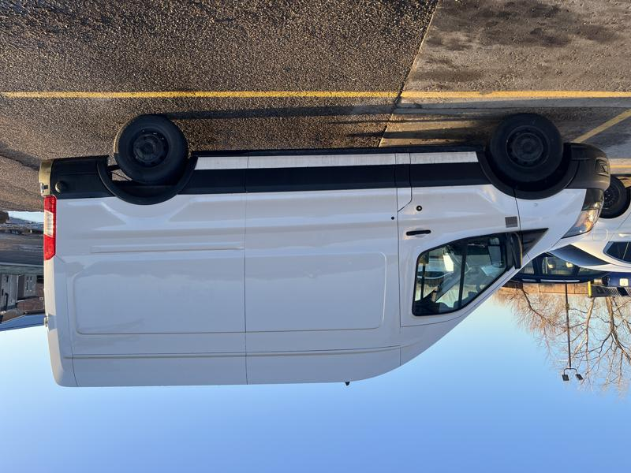
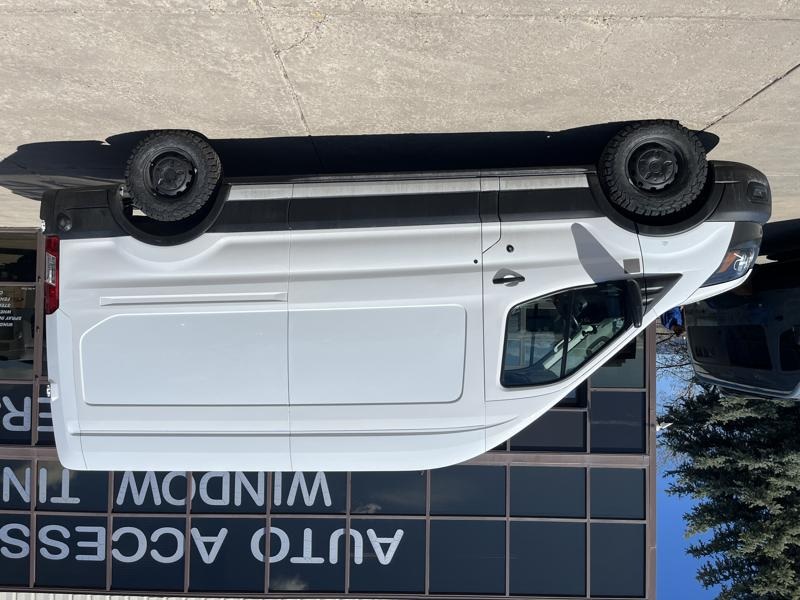
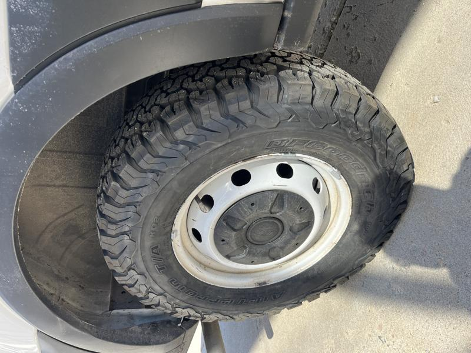
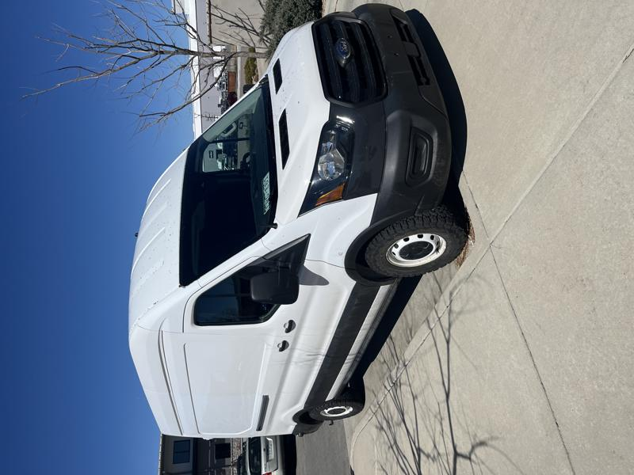

# New Tires

One of the concessions I had to make for my van project was to buy a used van that was rear wheel drive, not all wheel drive AWD. I considered all the places I would like to take the van and snowy weather was just not somewhere I would be often in this van, but living in Colorado you have to be prepared for any kind of weather. So I decided on all terrain tires plus traction boards for the van. Possibly looking at adding snow chains in the future but this is a good start.

These tires are 255/70/R16 BFGoodrich KO2's which funny enough are the same tire I have on my Jeep Wrangler. They fit the Transit great without any rubbing or pinch weld pounding/cutoff. Really happy with how they look and drive, they give the van a much more substantial feel on the road and only a small amount of road noise.

**Before:** Puny, pathetic donuts of tires barely able to withstand an I-70 pothole.

**After:** Meaty, aggresive tires ready to take Vincent Vango to places never before dreamed.

I decided to go black letter out on these tires, really aggresive tread.

Van has less of a front rake now, sits more level yay!

Next up, a much needed radio upgrade. :arrow_forward: [Radio Upgrade](radio.md)