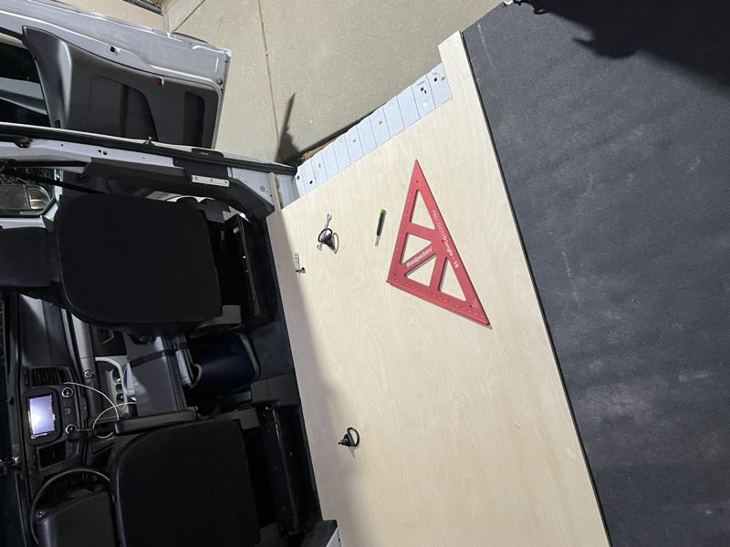
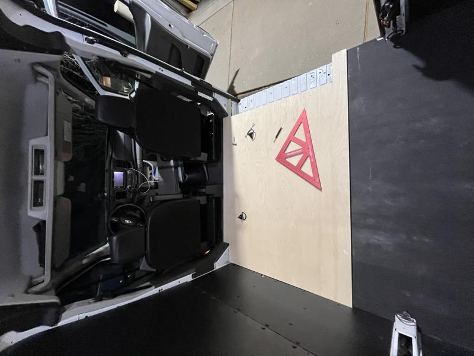
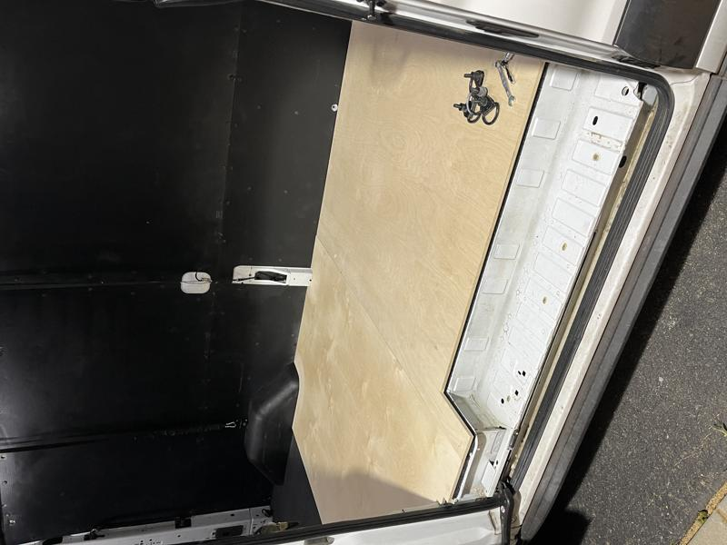
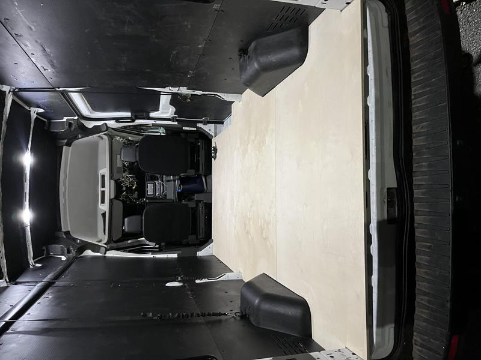
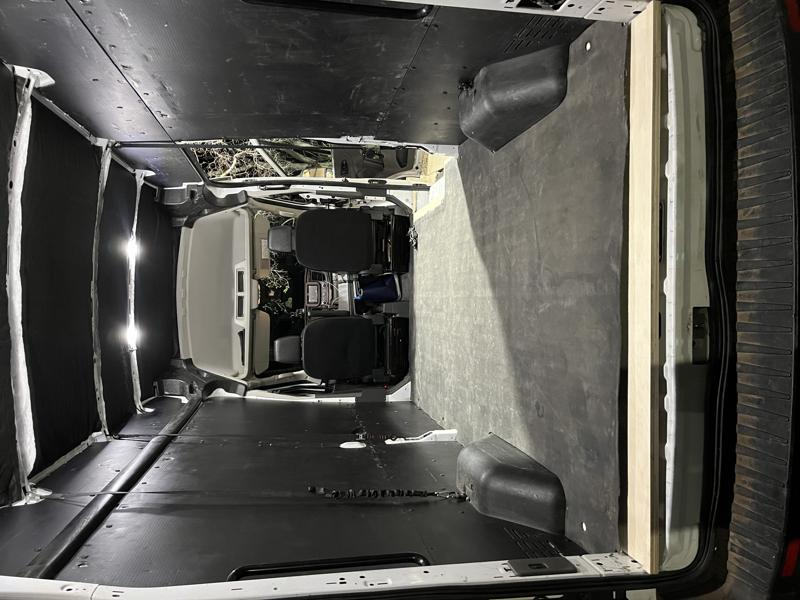
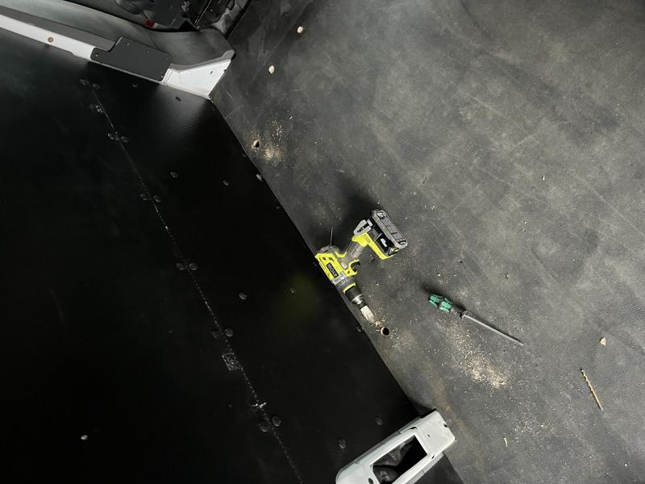

# Installing the subfloor

I decided upon 1/2" baltic birch plywood for the sub floor of the van. It's thick enough not to bend under the weight but not too thick and overkill for just light usage. I lucked out and was able to use the rubber floor mat that came with the van to template the sheets of plywood for cutting. It took 3 4x8 sheets to outfit the van with some scrap left over.

Here's the front section laid out with the cutout for the side step.

A wider shot of the front section of flooring installed.

Added the second panel in there cutting around part of the wheel wells.

The third section added to the van, I messed up and cut it a little short.

Here's the rubber floor mat laid over the subfloor. Still need to figure out how to cover the exposed wood.

Drilling the holes for the metal rib mounts/studs. I'll cover that in a different post.

Next up, installing the wood sub flooring. :arrow_forward: [Wood Subfloor](wood-subfloor.md)